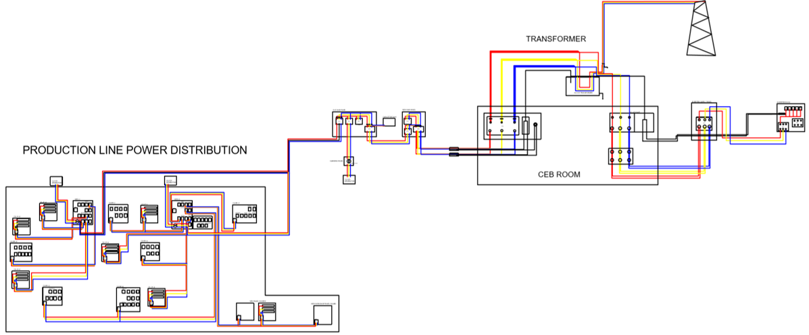

# Production Line Power Distribution Mapping

This project was completed as part of my internship at Cable Solutions (Pvt) Ltd. in 2019.  

It documents the **Power Distribution Hierarchy** of the company production line and provides the final **AutoCAD Power Distribution Drawing** integrating both production-level and company-level power systems.

The work involved inspecting distribution panels, mapping connections, and creating a unified technical drawing for maintenance and future expansion.

---

## 📌 Project Tasks
- **Inspection & Data Collection**  
  - Checked two main distribution panels in the production line.  
  - Documented connected machinery, sub-power panels, and lighting panels using tree diagrams.  
  - Verified panel-to-machine connections with assistance from machine operators.

- **Hierarchy Creation**  
  - Compiled findings into a detailed **Power Distribution Hierarchy**.  

- **CAD Drawing Development**  
  - Converted the hierarchy into an **AutoCAD drawing**.  
  - Integrated existing company-level distribution layout, including:  
    - CEB (Ceylon Electricity Board) supply lines  
    - Generators  
    - UPS room and backup systems  

- **Final Updates**  
  - Incorporated newly added power panels into the drawing.  
  - Delivered the final **Power Distribution Diagram**.

## 🔎 Power Distribution Block Diagram

> **Note:** The complete block diagram is intentionally zoomed out to avoid revealing any sensitive or proprietary details.

---

## 🛠 Tools & Skills Used
- **AutoCAD** – For technical diagram creation
- **Electrical Systems Knowledge** – Understanding panel boards, breakers, and distribution hierarchy

---

## 📬 Contact
If you have feedback or suggestions, feel free to [open an issue](https://github.com).
